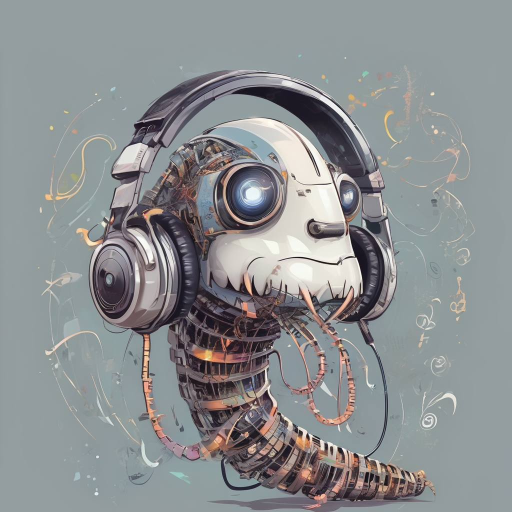

<p align="center">
  
</p>
<p align="center">
  Ohrwurm
</p>

Ohrwurm is a user-friendly bot designed to play music in Discord voice chats. Once added to your server, you can request a song using the command `/play {query}`, where query can be a URL to a YouTube video or playlist, or a simple search term. The bot will fetch the song and start playing it. You can pause the music with `/pause`, resume playback with `/resume`, and stop and clear the queue with `/stop`. If the bot is alone in a voice chat, it will automatically leave, but you can also manually make it leave with the `/leave` command.

# Deployment
To deploy Ohrwurm with Docker, you can use the [provided Docker image](https://hub.docker.com/r/jheuel/ohrwurm):
```bash
docker run -d \
  --name ohrwurm \
  --restart unless-stopped \
  -e DISCORD_TOKEN=YOUR_DISCORD_BOT_TOKEN \
  -e DISCORD_APP_ID=YOUR_DISCORD_APP_ID \
  -e ADMIN=YOUR_DISCORD_USER_ID \
  jheuel/ohrwurm:latest
```


Alternatively, you can create a `docker-compose.yml` file:
```yaml
services:
  ohrwurm:
    container_name: ohrwurm
    image: jheuel/ohrwurm:latest
    restart: unless-stopped
    env:
      - DISCORD_TOKEN=YOUR_DISCORD_BOT_TOKEN
      - DISCORD_APP_ID=YOUR_DISCORD_APP_ID
      - ADMIN=YOUR_DISCORD_USER_ID
```
and then run the image with `docker compose up`.
